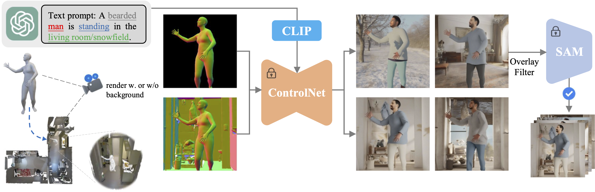

<div align="center">
<h1>
3D Human Reconstruction in the Wild with Synthetic Data Using Generative Models
</h1>

[Project Page](https://yongtaoge.github.io/projects/humanwild/), [Paper](https://arxiv.org/abs/2403.11111), [HuggingFace](https://huggingface.co/geyongtao/HumanWild)

[Yongtao Ge]()<sup>2,</sup><sup>1</sup>, [Wenjia Wang]()<sup>3</sup>, [Yongfan Chen]()<sup>1</sup>, [Hao Chen]()<sup>1</sup>, [Chunhua Shen]()<sup>1</sup>

<sup>1</sup>[Zhejiang University](https://www.zju.edu.cn/english/), &nbsp;
<sup>2</sup>[The University of Adelaide](https://www.adelaide.edu.au/aiml/), &nbsp;
<sup>3</sup>[The University of Hong Kong](https://www.hku.hk/) &nbsp;


</div>
<br/>
  


## 📢 News
2024-03-22: Release pretrained weight on [HuggingFace](https://huggingface.co/geyongtao/HumanWild) and demo code. <br>

## 🛠️ Dependencies
```
pip install -r requirements.txt
```

## 🚀 Demo
```
1. download the pretrained weight from huggingface repo and put it in $WEIGHT_DIR

2. inference the demo code
python demo.py \
--normal_image_path 'data/controlnet_condition/00000_0_0002.png' \
--prompt 'a man lift his leg in the wild, photo realistic.' \
--controlnet_conditioning_scale 0.75 \
--output_dir './output_dir' \
--normal_controlnet_dir $WEIGHT_DIR \
--num_inference_steps 50 \
--num_images_per_prompt 4
```

## 🌟 Acknowledgement

We acknowledge the use of the following sources in our paper.

- [BEDLAM](https://bedlam.is.tue.mpg.de/index.html)
- [SynBody](https://synbody.github.io/)
- [LAION5B](https://laion.ai/blog/laion-5b/)
- [COYO-700M](https://github.com/kakaobrain/coyo-dataset)
- [Hi4D](https://yifeiyin04.github.io/Hi4D/)

## 🎓 Citation
```
@article{ge2024humanwild,
    title={3D Human Reconstruction in the Wild with Synthetic Data Using Generative Models},
    author={Ge, Yongtao and Wang, Wenjia, and Chen, Yongfan, and Chen, Hao and Shen, Chunhua},
    journal={arXiv preprint arXiv:2403.11111},
    year={2024}
}
```


